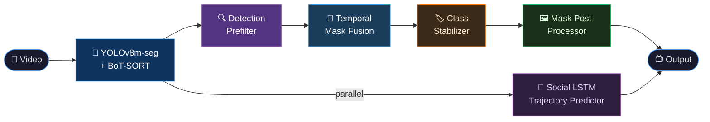
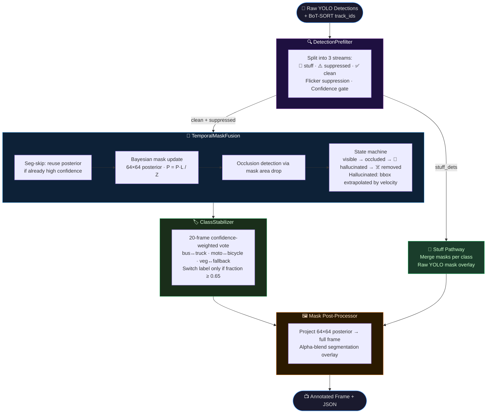

# 🛣️ Road-AI — Real-Time Segmentation & Trajectory Pipeline

> **YOLOv8m-seg · BoT-SORT · Bayesian Temporal Fusion · Social LSTM**  
> Built for Indian road dashcam footage. Tracks objects, stabilises noisy masks across frames, and predicts where everything is going next.

---

## ⚙️ How It Works



Six async threads run in parallel: **Capture → Inference → Writer → JSON → LSTM → Display**. The pipeline never drops frames — BoT-SORT tracking feeds a Bayesian posterior that hallucinates occluded objects for up to 8 frames, keeping masks stable even when YOLO misses a detection.

---

## 📁 Project Structure

```
Quarks_hacksagon/
├── main.py                     ← Entry point (run this)
├── config.yaml                 ← All paths & thresholds
├── requirements.txt
├── idd_yolov8_segmentation.py  ← YOLOv8 training script
├── evaluate_idd.py             ← YOLOv8 evaluation on IDD val set
│
├── eval_yolo_results/          ← Pre-computed eval outputs & analysis
├── weights/                    ← YOLOv8 model weights (download required)
├── data/
│   ├── inputs/                 ← Place input videos here
│   ├── outputs/                ← Pipeline results written here
│   └── idd20kII/               ← IDD dataset (download & unzip for training)
│
└── modules/
    ├── preprocess/             ← CLAHE + sharpening
    ├── segmentation/           ← YOLOv8 + BoT-SORT inference handler
    ├── temporal_fusion/        ← Bayesian mask stabiliser
    ├── tracking/               ← Tracker + Social LSTM bridge
    ├── botsort_module/         ← Standalone BoT-SORT (JSON I/O)
    └── social_lstm/            ← Social LSTM training, inference & evaluation
        ├── checkpoints/        ← LSTM weights (download required)
        └── data/argoverse/     ← Argoverse dataset (download for training)
```

---

## 📦 Installation

```bash
# 📂 1. Clone & enter the project
git clone https://github.com/Aanoush-Surana/Quarks_hacksagon.git
cd Quarks_hacksagon

# 🐍 2. Create virtual environment
python -m venv venv
venv\Scripts\activate        # Windows
# source venv/bin/activate   # Linux/macOS

# ⬇️  3. Install dependencies
pip install -r requirements.txt
```

> 🖥️ **CUDA GPU strongly recommended.** Install the matching PyTorch build from [pytorch.org](https://pytorch.org/get-started/locally/) before the step above.  
> ⚡ On first run with a CUDA GPU, the model is auto-exported to TensorRT (`.engine`). This takes ~3 minutes but makes every subsequent run significantly faster.

### ⚠️ Prerequisites — Downloads Required

> **This repository does not ship model weights or datasets.** You must download and place them manually before running the pipeline or training.

#### 🧠 For running the pipeline (required):

| What to download | Where to place it |
|-----------------|------------------|
| YOLOv8 IDD segmentation weights (`best.pt`) | `weights/best.pt` |
| Social LSTM checkpoint (`best.pt`) *(optional — enables trajectory prediction)* | `modules/social_lstm/checkpoints/best.pt` |

> 🔗 **Pre-trained weights** — [📥 Download from Google Drive](https://drive.google.com/drive/folders/11AE7Li3dmfjS4tA2njA_MB57tY_FW6iP?usp=sharing)

#### 🏋️ For training the models yourself:

| What to download | Where to place it |
|-----------------|------------------|
| [IDD20k II](https://idd.insaan.iiit.ac.in/) dataset | `data/idd20kII/` — unzip so that `leftImg8bit/` and `gtFine/` are direct children |
| [Argoverse 1](https://www.argoverse.org/av1.html) motion forecasting dataset | `modules/social_lstm/data/argoverse/` — place `train/data/` and `val/data/` inside |

---

## 🚀 Quickstart

### 📂 Step 1 — Add your files

| 📄 File | 📍 Where to put it |
|---------|-------------------|
| 🎥 Input video | `data/inputs/` |
| 🧠 YOLOv8 weights (`best.pt`) | `weights/` |
| 🔮 Social LSTM checkpoint *(optional)* | `modules/social_lstm/checkpoints/best.pt` |

> 🔗 **Pre-trained weights** — [📥 Download from Google Drive](https://drive.google.com/drive/folders/11AE7Li3dmfjS4tA2njA_MB57tY_FW6iP?usp=sharing)
> - 🧠 YOLOv8 IDD model → place in `weights/best.pt`
> - 🔮 Social LSTM Argoverse model → place in `modules/social_lstm/checkpoints/best.pt`

Update `config.yaml` to point at your video:

```yaml
paths:
  default_video_input: "data/inputs/your_video.mp4"
  default_weights:     "weights/best.pt"
```

### ▶️ Step 2 — Run

```bash
# ⚙️  Use defaults from config.yaml
python main.py

# 🎛️  Override on the CLI
python main.py --video_path data/inputs/my_vid.mp4 --weights_path weights/best.pt
```

> ⌨️ Press **`Q`** in the live window to stop.

---

## 🎛️ Configuration

### ⚙️ `config.yaml`

```yaml
paths:
  default_video_input: "data/inputs/sample_new.mp4"
  default_weights:     "weights/best.pt"
  output_tracking:     "data/outputs/tracking"   # JSON + video saved here

pipeline:
  conf_thresh: 0.25    # 🎯 YOLO detection confidence threshold
  iou_thresh:  0.45    # 📐 NMS IoU threshold
  # preprocess_resolution: [640, 640]  # Uncomment to force resize
```

### 🔘 Toggles in `main.py`

| 🏳️ Flag | Default | 💬 What it does |
|---------|---------|----------------|
| `ENABLE_PREPROCESSING` | `False` | 🖼️ CLAHE + sharpening on each frame. Keep off for pure neural inference. |
| `SHOW_REALTIME_STREAM` | `True` | 📺 `True` → live window. `False` → saves annotated MP4 to `output_tracking/`. |
| `SAVE_LSTM_JSON` | `False` | 💾 Save LSTM trajectory predictions to a JSON file alongside the video. |

### 🌊 Temporal Fusion — Internal Architecture




### 🌊 Temporal Fusion knobs *(in `temporal_fusion_core.py`)*

| 🔧 Parameter | Default | 💬 Effect |
|------------|---------|----------|
| `hallucination_max_frames` | `8` | 👻 Frames an occluded object is kept alive |
| `buffer_size` | `15` | 📜 Rolling history for Bayesian posterior |
| `skip_seg_confidence_threshold` | `0.82` | ⏭️ Above this, skip re-segmenting a stable object |
| `skip_seg_max_consecutive` | `3` | 🔁 Max frames in a row to skip segmentation |
| `occlusion_area_ratio` | `0.6` | 📉 Area drop fraction before marking as occluded |

### 📍 BoT-SORT knobs *(in `modules/botsort_module/config/botsort.yaml`)*

| 🔧 Parameter | Default | 💬 Effect |
|------------|---------|----------|
| `track_high_thresh` | `0.5` | ✅ Min confidence for a solid detection |
| `new_track_thresh` | `0.6` | 🆕 Min score to start a new track |
| `track_buffer` | `30` | ⏳ Frames to keep a lost track |
| `match_thresh` | `0.65` | 🔗 IoU gate for track↔detection matching |
| `gmc_method` | `sparseOptFlow` | 🎯 Global motion compensation (required) |
| `with_reid` | `false` | 👤 Enable appearance ReID (needs a video path + weights) |

---

## 📤 Output

When `SHOW_REALTIME_STREAM = False`, files are written to `data/outputs/tracking/`:

| 📄 File | 📋 Contents |
|---------|------------|
| 🎬 `<video_name>_final.mp4` | Annotated segmentation + tracking video |
| 🗂️ `<video_name>_results.json` | Per-frame detections: `track_id`, `bbox`, `class_name`, `confidence`, `state` |
| 🔮 `<video_name>_lstm_final.mp4` | LSTM trajectory overlay video *(if LSTM loaded)* |

> 📊 The live HUD shows: **FPS · Frame counter · Active/unique objects · Inference latency · Class breakdown**

---

## 🏋️ Training Scripts

### 🧠 YOLOv8 Segmentation Model

Fine-tuned from `yolov8m-seg.pt` on **[IDD20k II](https://idd.insaan.iiit.ac.in/)** 🇮🇳 — an Indian road dataset with 30 classes including India-specific labels like `autorickshaw`. `road + parking + drivable fallback` are merged into a single `drivable_area` class.

**📥 Step 1 — Get the dataset & place it**

Download [IDD20k II](https://idd.insaan.iiit.ac.in/) and place it inside the project:

```
Quarks_hacksagon/
└── data/
    └── idd20kII/                        ← 📂 unzip here
        ├── leftImg8bit/{train,val,test}/ ← 🖼️ .jpg images
        └── gtFine/{train,val,test}/      ← 📋 *_polygons.json annotations
```

**⚙️ Step 2 — Configure paths** (top of `idd_yolov8_segmentation.py`)

```python
IDD_ROOT = r"data/idd20kII"   # ← 📂 relative to project root
PROJECT  = "runs/segment"     # ← 📤 training output folder
```

**🔄 Step 3 — Convert dataset → YOLO format** *(~10–30 min)*

```bash
python idd_yolov8_segmentation.py
# 📋 Converts polygon JSONs to YOLO .txt labels and writes data.yaml
# 🔀 Merges drivable classes, skips junk labels, writes images + labels + data.yaml
```

**🚂 Step 4 — Train**

Key parameters (Cell 4 of the script):

| 🔧 Param | Default | 💬 Notes |
|--------|---------|---------|
| `BATCH_SIZE` | `2` | 📦 Increase if you have more VRAM |
| `EPOCHS` | `20` | 🔁 Start here; resume to push higher |
| `IMGSZ` | `640` | 🖼️ Standard. `1280` for more accuracy |
| `amp` | `True` | ⚡ FP16 — saves ~40% VRAM |
| `optimizer` | `AdamW` | 🎛️ |
| `lr0` | `0.001` | 📉 Initial learning rate |

```
🖥️  VRAM   →  📦 Recommended batch size
    6 GB   →  2–4
    8 GB   →  6
    12 GB  →  8
    16 GB+ →  10–16
```

Training saves to `runs/segment/<run_name>/weights/`. Copy `best.pt` → `weights/best.pt`.

**♻️ Resuming from a checkpoint:**

```python
results = model.train(data=DATA_YAML, epochs=40, resume=True)
```

---

### 🔮 Social LSTM Trajectory Predictor

Predicts the next **1.2 seconds** of motion for every tracked object. Runs live inside the pipeline if `modules/social_lstm/checkpoints/best.pt` exists.

**📥 Get Argoverse 1** → [argoverse.org/av1.html](https://www.argoverse.org/av1.html)

Place the dataset inside the Social LSTM module:

```
Quarks_hacksagon/
└── modules/social_lstm/
    └── data/
        └── argoverse/                   ← 📂 unzip here
            ├── train/data/              ← 📋 .csv scenario files
            └── val/data/
```

**🚂 Train:**

```bash
cd modules/social_lstm

python train.py \
  --data_dir  data/argoverse/train/data \
  --val_dir   data/argoverse/val/data   \
  --output_dir checkpoints              \
  --epochs 200 --batch_size 64

# ♻️  Resume from checkpoint
python train.py --resume checkpoints/last.pt --epochs 200
```

Key arguments:

| 🔧 Flag | Default | 💬 Description |
|-------|---------|--------------|
| `--hidden_dim` | `128` | 🧠 LSTM hidden state size |
| `--embedding_dim` | `64` | 🔢 Input embedding size |
| `--pred_len` | `12` | ⏱️ Steps to predict (12 × 0.1 s = 1.2 s) |
| `--lr` | `1e-3` | 📉 Adam learning rate |
| `--nb_size` | `32.0` | 📏 Social pooling radius in metres |

💾 Checkpoints: `checkpoints/last.pt` (every epoch) · `checkpoints/best.pt` (best val ADE)

**🔍 Standalone inference on a tracking JSON:**

```bash
python predict.py \
  --checkpoint   checkpoints/best.pt      \
  --botsort_json ../../data/outputs/tracking/video_results.json \
  --output_json  predictions.json         \
  --pixels_per_metre 10.0
```

**🎬 Visualise predictions on video:**

```bash
python utils/visualise.py \
  --video       ../../data/inputs/my_video.mp4 \
  --predictions predictions.json               \
  --output      annotated.mp4                  \
  --pixels_per_metre 10.0 --show_samples
```

---

## 📊 Evaluation — YOLOv8 on IDD

`evaluate_idd.py` runs per-pixel segmentation evaluation against IDD20k II ground-truth polygons and produces metrics + visualisations.

**▶️ Run:**

```bash
python evaluate_idd.py \
  --model   weights/best.pt \
  --images  data/idd20kII/leftImg8bit/val \
  --gt_json data/idd20kII/gtFine/val \
  --output  eval_yolo_results/
```

| 🔧 Arg | Default | 💬 Description |
|--------|---------|---------------|
| `--model` | *(required)* | Path to `best.pt` or `last.pt` |
| `--images` | *(required)* | `leftImg8bit/val/` root |
| `--gt_json` | *(required)* | `gtFine/val/` root |
| `--output` | `eval_results/` | Output folder for plots + JSON |
| `--limit` | `None` | Evaluate only first N images (quick test) |
| `--samples` | `6` | Number of overlay comparison images to save |

**📤 Outputs** written to `--output`:

| 📄 File | Contents |
|---------|---------|
| `metrics_summary.json` | mIoU · Pixel Accuracy · Mean Class Accuracy · per-class IoU |
| `confusion_matrix.png` | Normalised heatmap — top-15 classes by frequency |
| `per_class_iou.png` | Bar chart of per-class IoU with mIoU line |
| `overlays/sample_XXXX.png` | Side-by-side: input · ground truth · prediction |

**📈 Current benchmark results** (`eval_yolo_results/metrics_summary.json`):

| Metric | Score |
|--------|-------|
| 🎯 mIoU | **0.2103** |
| 🖼️ Pixel Accuracy | **0.2865** |
| 📊 Mean Class Accuracy | **0.2763** |

> Strong on traffic objects (car 0.69, autorickshaw 0.68, road 0.70, person 0.59) — naturally weaker on rare small classes (sidewalk, pole, traffic sign) which appear infrequently in the IDD val split.

---

## ⚠️ Known Gotchas

| ❗ Issue | ✅ Fix |
|---------|-------|
| 🔴 TensorRT export fails | Pipeline auto-falls back to `.pt`. Install TensorRT separately for the speed-up. |
| 🪟 `workers > 0` hangs on Windows | Already set to `workers=0` in all loaders. |
| 🔮 Social LSTM missing — no trajectory overlay | Place `best.pt` in `modules/social_lstm/checkpoints/`. Pipeline runs fine without it. |
| 🎥 Video won't open | Check the path in `config.yaml`. Use forward slashes or raw strings on Windows. |
| 💾 Out of memory during training | Lower `BATCH_SIZE` or set `cache=False` (already default). |
